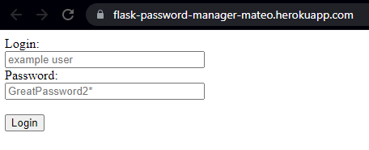
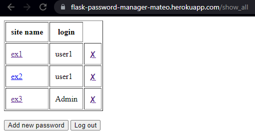
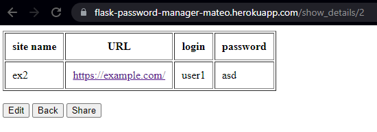
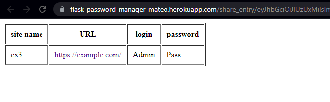
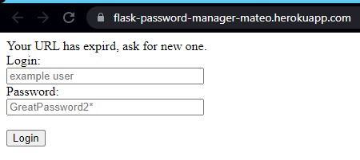
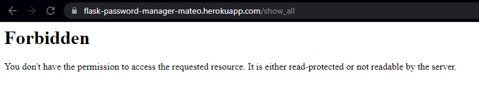

# FLASK_Password_Manager
Web-Based Password Manager.

## Table of contents
* [General info](#general-info)
* [Screenshots](#screenshots)
* [Technologies](#technologies)
* [Setup](#setup)
* [Status](#status)

## General info
It is one of the Flask projects which is suppoused to hone my skills in web development.

Main goals of the project were:
* Store passwords for websites in a database.
* Passwords should be stored securely.
* UI is minimalistic, should include CRUD operations.
* The link to the page should open in a new window.
* Add a sharing function - the generated link should be valid only for a limited time and not give access to the whole application.
* Share link can't be stored in DB.

As an IDE I used Pycharm from JetBrains.

Tools used:
* As Web App Framework I used __Flask__ - It gives great flexibility to work and I have the most experience with this tool.
* To communicate with DB I used __SQLAlchemy__, its SQL toolkit and ORM works quite well with Flask.
* Whole UI is based only on HTML.
* For now there is only one hardcoded user in DB. (If there is none, first one will be created)
* The architecture is designed to add multi-user functionality. (Relational databases have been created with user-password_entry links)
* To store password securely I used __Fernet__ library. It is an implementation of symmetric authenticated cryptograph.
Fernet encrypts message that cannot be read or altered without the key. It is URL-safe base64-encoded. For a key I used Flask's Secret key.
* To generate a time-valid link I used __TimedJSONWebSignatureSerializer__ from __itsdangerous__ library.
It serialize given object (only time-stamp in this case) and then desrialize it and check if time which passed is greater then __expires_in__ parameter.
When time expires given URL redirect user to the home page with an appropriate message.
* App is deployed on Heroku and it's available [here](https://flask-password-manager-mateo.herokuapp.com/)

## Screenshots

## Technologies
All techngologies used for this project are included in requirements.txt file.

## Setup
You can use the IDE or Terminal to build this project. Below I present the instructions on how to run the program.
Actuall verion is in __sahre_link__ branch!

1.Clone the repository.
2.Unzip project.
3.Go to the folder where you unpacked this project.
4.Run: pip install -r requirements.txt in your shell.
5.Run: main.py
6.Go to Your local host link. (For me it's 127.0.0.1 with port 5000).
7.Play around.

## Ideas for further development
* Add multi-user functionality.
* Use only __Fernet__ to generate time valid link.
* Hash and salt password of further users.

## Status
Project is: _in_progress_.
